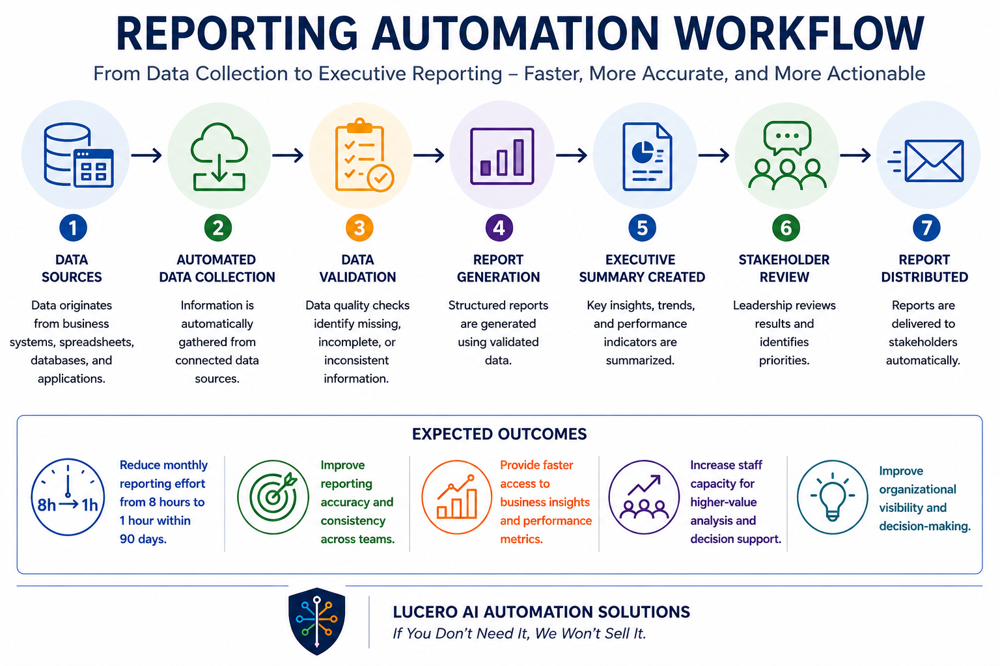

## Outcome

Reduce monthly reporting effort from 8 hours to 1 hour while improving reporting accuracy, visibility, and decision-making.

---

## Overview

This project demonstrates how organizations can automate recurring reporting processes by collecting, organizing, and summarizing data from multiple sources.

The workflow is designed to reduce manual report preparation while providing leaders with timely and actionable information.

---

## Business Challenge

Many organizations spend significant time:

- Gathering data from multiple systems
- Updating spreadsheets
- Preparing recurring reports
- Creating executive summaries
- Verifying information accuracy
- Distributing reports to stakeholders

These manual activities consume valuable staff time and delay decision-making.

---

## Solution

The Reporting Automation Workflow streamlines recurring reporting by automatically collecting data, generating summaries, and preparing reports for stakeholders.

### Workflow

Data Sources

↓

Automated Data Collection

↓

Data Validation

↓

Report Generation

↓

Executive Summary Created

↓

Stakeholder Review

↓

Report Distributed

---

## Expected Outcomes

### Reduced Reporting Effort

Reduce monthly reporting effort from 8 hours to 1 hour within 90 days.

### Faster Decision-Making

Provide leaders with timely access to critical information.

### Improved Accuracy

Reduce manual data entry and reporting errors.

### Better Visibility

Create consistent reporting across departments and teams.

### Increased Staff Capacity

Allow employees to focus on higher-value activities.

---

## Technology Examples

This workflow could be implemented using technologies such as:

- Excel
- Power BI
- Tableau
- SQL
- Microsoft Power Automate
- Zapier
- OpenAI
- Google Sheets

Technology selection depends on organizational requirements and existing systems.

---

## Business Impact

Organizations implementing reporting automation workflows can:

- Reduce reporting preparation time
- Improve reporting consistency
- Improve decision-making speed
- Increase data visibility
- Reduce manual effort
- Improve operational efficiency

---

## Who This Helps

- Nonprofit Organizations
- Educational Programs
- Professional Services Firms
- Healthcare Organizations
- Government Agencies
- Small Businesses

---

## Consulting Approach

Lucero AI Automation Solutions follows a trust-based approach:

> If You Don't Need It, We Won't Sell It.

The objective is to identify the simplest solution that delivers measurable business results without unnecessary software, subscriptions, or complexity.

---

## Project Status

Portfolio Demonstration Project

This project demonstrates a practical reporting automation workflow and is intended as an example of how recurring reporting processes can be redesigned to improve efficiency, visibility, and decision-making.
